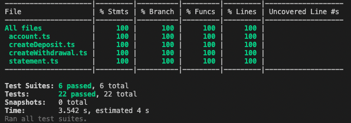

## Bank Account

- A TypeScript app for a simple bank account

#### How to use

- Clone this repo and run `npm install` to install dependencies
- Run `npm test` for Jest tests and `npx jest --coverage` to see test coverage

#### Approach

- `createDeposit` & `createWithdrawal` are factory functions that produce objects of type `Transaction`.
- `Account` class has `makeDeposit()` and `makeWithdrawal()` methods that add a `createDeposit()` or `createWithdrawal()` to a transactions array
- The current account balance is the balance of the last transaction in the array. As each transaction stores its own resulting balance the transaction history can be displayed.
- The `Statement` class iterates over the reversed transactions array of an `Account` instance and formats the information as a string including date, amount and balance per transaction in reverse chornological order.

#### Mocking with Jest & TypeScript

- Here is a [blog post](https://medium.com/@rita.aktay/makers-mocking-typescript-jest-dc917f3db9f3) I wrote about mocking with TypeScript and Jest during this project.

#### Test Coverage

